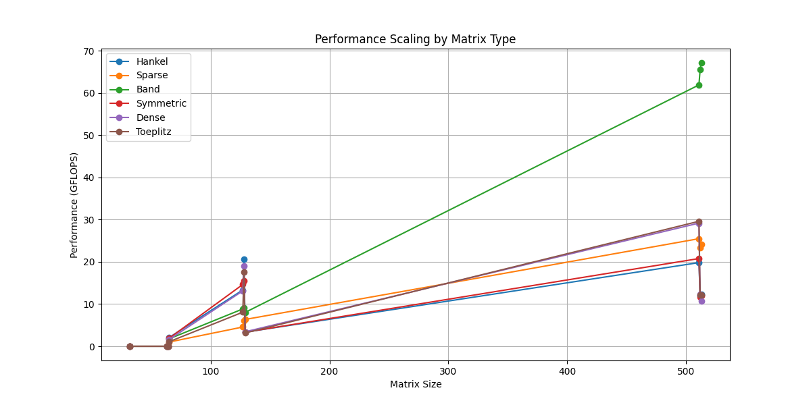
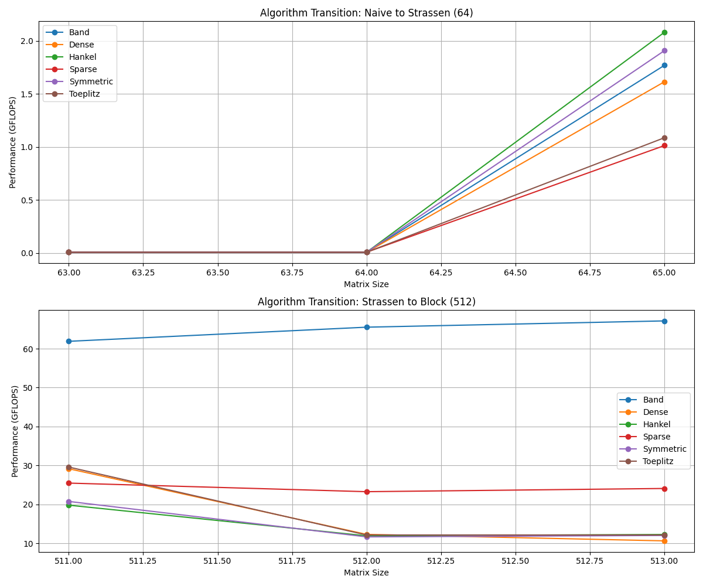
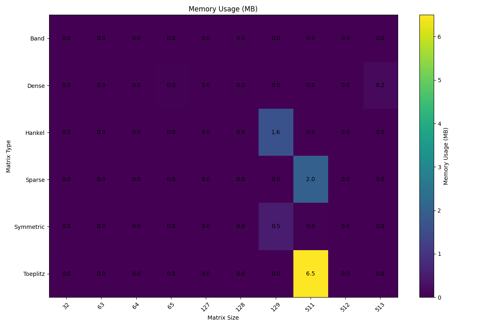
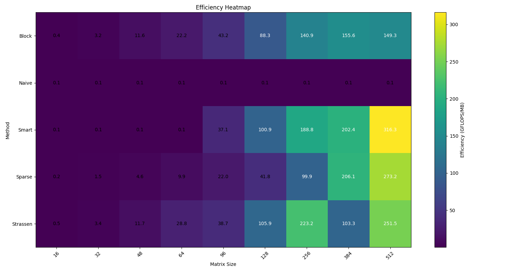
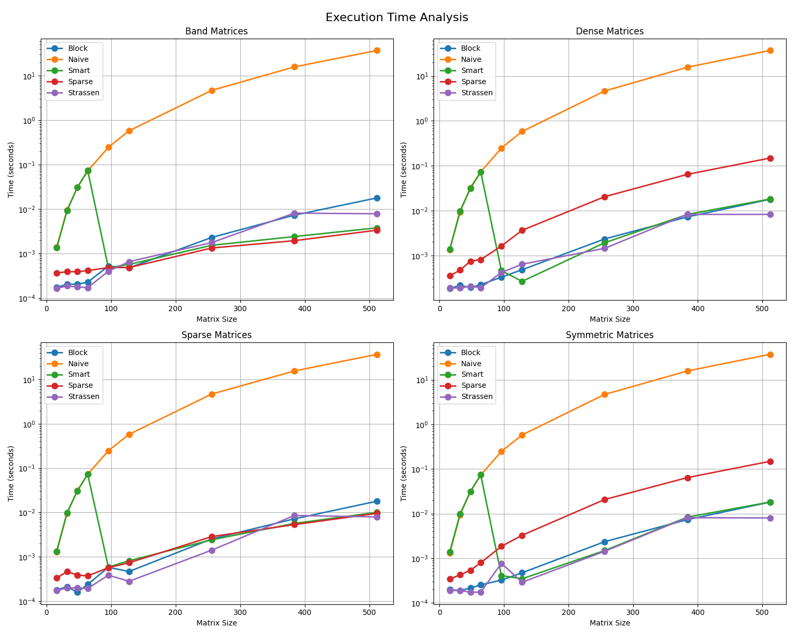
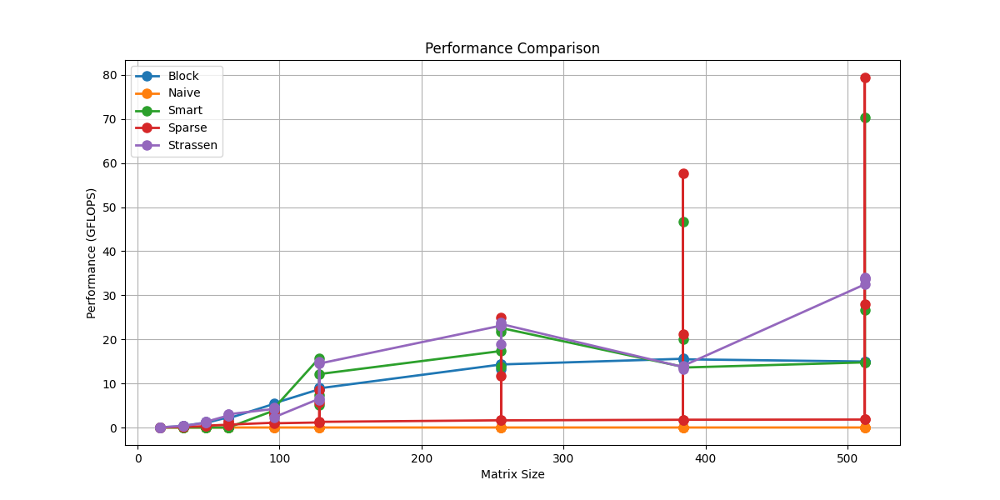

# MathAlgebra Test Visualizations

This directory contains comprehensive test suites and performance visualizations for the MathAlgebra library.

## Performance Visualizations

### Algorithm Performance Analysis
<div align="center">
  
  <p><em>Performance scaling across different matrix sizes and types</em></p>
</div>

### Algorithm Transition Analysis
<div align="center">
  
  <p><em>Performance analysis at algorithm transition points (64×64 and 512×512)</em></p>
</div>

### Memory Usage Analysis
<div align="center">
  
  <p><em>Memory consumption patterns across different algorithms</em></p>
</div>

### Efficiency Analysis
<div align="center">
  
  <p><em>Algorithm efficiency heatmap across matrix sizes</em></p>
</div>

### Time-Based Analysis
<div align="center">
  
  <p><em>Detailed execution time analysis by matrix type</em></p>
</div>

### Performance Comparison
<div align="center">
  
  <p><em>Direct comparison of algorithm performance metrics</em></p>
</div>

## Running Tests

To generate these visualizations, run:

```bash
python -m pytest tests/test_matrix_multiplication.py -v
```

## Note

- All visualizations are automatically generated during test execution
- Images are updated with each test run
- Higher resolution versions are available in the results directory 